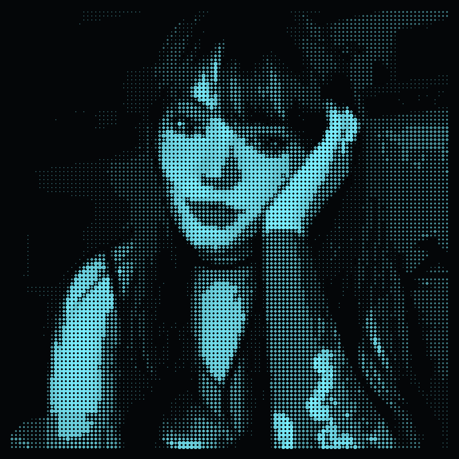

<table>
<tr>
<td width="340">

</td>
<td>
Mari@Frontend-grid ──────────────────────────────────

.  Subject: ..................... Mari
.  Role: ......................... Front-end Web Designer
.  Origin: ....................... Brasil
.  Status: ....................... Estudando • Codando • Criando
.  Formação: ..................... Publicidade e Propaganda (ADS)
.  Cursando: ..................... Pós-graduação em AWS
.
.  Frontend: ...................... HTML, CSS, JavaScript, TypeScript, React, Vue
.  Backend: ....................... PHP, Python
.  Design: ........................ Figma, Photoshop
.  Motion: ......................... After Effects, Premiere Pro
.  Cloud: .......................... AWS
.
- Contact ─────────────────────────────────────────────
.  Mail: ........................... seuemail@gmail.com
.  Portfolio: ...................... seuportfolio.com
.  LinkedIn: ....................... linkedin.com/in/seu-usuario
.  GitHub: ......................... github.com/SEU_USUARIO
.
- GitHub Stats ────────────────────────────────────────
.  Repos: .......... 00  { Contributed: 00 }  |  Stars: ..... 00
.  Commits: ......... 00                       |  Followers: . 00
.  Lines of Code on GitHub: ....... 00 ( +00, -00 )
────────────────────────────────────────────────────────

</td>
</tr>
</table>
 

  

 
📊 GitHub Stats

  
  

